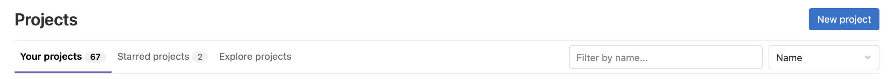

## Wie Websites funktionieren

Wenn wir einen Webbrowser verwenden, um eine Seite im World-Wide-Web zu besuchen,
fordert der Browser Informationen von einem Server an - einem Computer, der die für die
Website relevanten Daten speichert und so konfiguriert ist, dass er Anfragen nach diesen
Daten empfängt und beantwortet. Unter der Annahme, dass es in dieser Phase keine
Probleme gab (z. B. die Anfrage nach einer Seite, die nicht existiert, oder die
Unmöglichkeit, den Server zu erreichen), empfängt und interpretiert unser Browser diese
Informationen, um die Webseite auf unserem Bildschirm darzustellen.

Ein Webentwickler wäre wahrscheinlich entsetzt, wenn er eine solch grobe Vereinfachung
lesen würde, was nur ein Grund dafür ist, dass Webentwickler nicht die Zielgruppe dieses
Lehrgangs sind.

Die vom Webbrowser angezeigte Seite ist das Ergebnis der Kombination von **HTML** -
einem hierarchischen Format, das die Strukturelemente der Seite und ihren Rohinhalt
beschreibt - mit **CSS** - einem geordneten Satz von Styling-Anweisungen, die dem
Browser mitteilen, wie der Inhalt organisiert und formatiert werden soll - und allen
**Bildern**, die in die Seite eingebettet werden sollen. Andere Informationen, die vom
Server empfangen, aber vom Browser nicht angezeigt werden, umfassen **Metadaten**,
**Cookies** und andere nicht sichtbare Elemente im HTML - Informationen über die
Website, die für einen Computer relevant sein könnten, aber wahrscheinlich für einen
Menschen nicht interessant sind (es gibt [Ausnahmen][qwantz-easter-egg-ext] dazu) - und
Skripte, die der Browser als Reaktion auf verschiedene Auslöser ausführen kann.

## Hallo Welt in HTML

Wenn Sie eine neue Programmiersprache lernen, finden Sie oft einen Verweis auf das
beliebte `Hello world`-Beispiel. Diese Beispiele erfassen typischerweise den einfachsten
Code, der den Text "Hello, World!" erzeugen und auf dem Bildschirm anzeigen kann.

Da HTML das Vorhandensein bestimmter Tags voraussetzt und diese fast immer in
übereinstimmenden Paaren vorkommen müssen (öffnendes `<tag>` und schließendes `</tag>`),
neigen HTML-Dokumente dazu, ziemlich schnell langatmig zu werden.

Das einfachste, gültige HTML `Hello world` ist:

~~~
<!DOCTYPE html>
<html>
  <head>
    <title>Page title</title>
  </head>
  <body>
    
Hello, World!

  </body>
</html>
~~~
> 
{: .language-html }

Wie Sie sich vorstellen können, ist es ziemlich mühsam, lange HTML-Dokumente von Hand zu
schreiben. Beachten Sie, dass wir keine Angaben darüber gemacht haben, wie und wo der
Text angezeigt werden soll.

Um dies zu erreichen, müssten wir zusätzlich stilisierte Tags oder Cascading Style
Sheets (CSS)-Anweisungen einfügen. Wenn Sie keine CSS-Anweisungen bereitstellen
(entweder innerhalb Ihres HTML-Dokuments oder als separate Datei), wird ein Webbrowser
das Layout der HTML-Elemente auf der Seite auf der Grundlage seiner
Standardeinstellungen nach bestem Wissen und Gewissen festlegen.

> ## Die vielen Tags in HTML
> 
> In dem obigen Beispiel `Hello world` werden 5 verschiedene Tags verwendet (`html`,
> `head`, `title`, `body` und `p`) in ihrer offenen `<>` und geschlossenen `</>` Form.
> Wir sehen auch den speziellen `doctype`-Tag, der das Format und die Version des
> Dokuments angibt, in diesem Fall, [HTML(5)][html5-wikipedia].
> 
> Es gibt viele weitere Tags zur Definition:
> - *strukturelle Elemente*, wie `table`, `div`, `span`, `nav`, `section`;
> - *Listen*, wie `ul` (für ungeordnete Listen) und `or` (für geordnete Listen);
> - *stilisierte Elemente*, wie z.B. `i`/`em` (für *Kursivschrift/Hervorhebungen*),
>   `b`/`strong` (für **fett**) und `u` (für <u>unterstrichenen Text</u>);
> - *Überschriften*, nummeriert von `h1` bis `h6` für Überschriften und zunehmend
>   kleinere Unterüberschriften;
> - *Medienelemente*, wie `img`, `video`, `audio` zum Einbetten von Rich-Media-Inhalten;
>   und
> - *Links*, wobei das wichtige `a` (Anker)-Tag verwendet wird, um auf Abschnitte auf
>   derselben Seite oder auf andere Seiten innerhalb derselben oder externer Websites zu
>   verweisen.
> 
> Die [Liste der gültigen HTML-Tags][html5-tags] ist ziemlich umfangreich und deckt eine
> Vielzahl von Funktionen ab, die das heutige World Wide Web ausmachen.
> 
{: .callout }

> ## Übung: Grundlegendes HTML schreiben
> 
> Gegeben sei der stilisierte Text:
> 
> <h1><em>Hello</em>, World!</h1>
> 
> Schreiben Sie den HTML-Code, der das gleiche Ergebnis liefert. **Tipp** Die große
> Schrift wird durch die Verwendung einer Überschrift erreicht.
> 
> > ## Lösung
> > 
> > ~~~
> > <h1><em>Hello</em>, World!</h1>
> > ~~~
> > {: .language-html }
> > 
> {: .solution }
> 
{: .challenge }

Schreiben wir ein komplexeres HTML-Beispiel mit einer Tabelle, die den "Hello,
World!"-Text in verschiedenen Sprachen zeigt und wie folgt gerendert wird {: .image-with-shadow width="600px" }

Der HTML-Code für eine solche Tabelle sieht folgendermaßen aus (Sie können den
Ausschnitt in die HTML-Datei kopieren und einfügen, die Sie im vorherigen Beispiel
erstellt haben):
~~~
<table>
    <tr><th>Language</th><th>Text</th></tr>
    <tr><td>English</td><td>Hello, World!</td></tr>
    <tr><td>French</td><td>Bonjour, le monde!</td></tr>
    <tr><td>Portuguese</td><td>Olá, Mundo!</td></tr>
    <tr><td>Serbian</td><td>Zdravo, svete!</td></tr>
</table>
~~~
> 
{: .language-html }

Jede Zeile ist zwischen den Tags **t**able **r**ow `<tr>` und `</tr>` eingeschlossen.
Innerhalb einer Zeile werden die Tags `<th>` und `</th>` verwendet, um **t**able
**h**eadings (spezielle Tabellenzellen, die in fetter Schrift dargestellt werden) zu
enthalten, während normale **t**able **d**ata-Zellen in den Tags `<td>` und `</td>`
enthalten sind.

Ein ähnliches Beispiel, das mit HTML-Listen geschrieben wurde, würde wie folgt aussehen:
{: .image-with-shadow width="600px" }

~~~
<ul>
    <li>English: Hello, World!</li>
    <li>French: Bonjour, le monde!</li>
    <li>Portuguese: Olá, Mundo!</li>
    <li>Serbian: Zdravo, svete!</li>
</ul>
~~~
> 
{: .language-html }

Hier haben wir die **u**nordered **l**ist-Tags `<ul>` und `</ul>` verwendet, um eine
Liste mit 4 Elementen zu definieren, die wiederum in einzelne **l**ist **i**tem (`<li>`
und `</li>`) Tags verpackt sind.

## Statische vs. dynamische Sites

_Statische_ Seiten sind Seiten, deren Inhalt auf einem Server gespeichert ist und an
jeden Benutzer gesendet werden kann, der eine Anfrage für diese Webseite stellt. Bei
einer Anfrage braucht der Server nur die Informationen zu senden, aus denen die Webseite
besteht (wie HTML und CSS). Websites, die sich nicht oft ändern, wie z. B. eine Website
mit dem eigenen Lebenslauf, werden oft als statische Websites gespeichert.

Im Gegensatz dazu sind _dynamische_ Sites solche, deren Seiten generiert werden, wenn
ein Benutzer eine Anfrage für eine Webseite stellt. Je nachdem, wann die Anfrage
gestellt wird, kann sich der Inhalt ändern; wenn man zum Beispiel bei einer Diskussion
in einem Webforum auf Aktualisieren klickt, können neue Kommentare erscheinen. Der
Hauptunterschied besteht darin, dass statische Seiten nur einmal generiert werden müssen
und danach unverändert auf dem Server verbleiben, im Gegensatz zu dynamischen Seiten,
die von einem Server jedes Mal neu generiert werden, wenn er eine Anfrage erhält.

> ## Beispiele aus dem Bereich der Biowissenschaften
> 
> Ein typisches Beispiel für eine _statische_ Website im Bereich der Biowissenschaften
> wäre die Dokumentation eines Werkzeugs oder eines Dateiformats, wie diese Seite auf
> [wwpdb.org](https://www.wwpdb.org/documentation/file-format).
> 
> Die Einstiegsseiten der [PDB-Datenbank] (https://www.rcsb.org/) laden den Inhalt auf
> der Grundlage der vom Benutzer gewählten Visualisierungswerkzeuge und -optionen
> unterschiedlich. Eine Datenbank oder ein Webserver ist normalerweise eine _dynamische_
> Website.
> 
{: .callout}

Diese Lektion konzentriert sich auf statische Websites und Tools, die zu ihrer
Erstellung verwendet werden können, die sogenannten **Static Site Generators**.

Einer der Vorteile des Einsatzes von Generatoren für statische Seiten ist, dass sie uns
die manuelle Erstellung einer Menge HTML ersparen, so dass wir uns auf den für Menschen
lesbaren Inhalt unserer Seiten konzentrieren können. Allerdings müssen wir dem Generator
noch mitteilen, wie unsere Inhalte aussehen sollen, wenn sie im Browser angezeigt
werden. Dazu verwenden wir ein Werkzeug namens Markdown, das wir in einer der nächsten
Folgen kennenlernen werden.

_Abbildung 1.1: Alternativen der Seitenerstellung. Diese Abbildung ist eine modifizierte
Version des Originals, das in [JavaScript for Data Science][js4ds] veröffentlicht wurde,
und wird hier mit Genehmigung des Autors wiedergegeben._

Statische Websites sind eine gute Wahl, wenn die Informationen, die Sie auf einer
Website anzeigen möchten, immer gleich sind, unabhängig davon, wer Ihre Website besucht
und wann, und wenn sich der Inhalt Ihrer Seiten wahrscheinlich nicht sehr oft ändern
muss. Daher sind statische Seitengeneratoren eine gute Wahl für Websites, die
Dokumentationen oder Lehrinhalte wie diese Seite bereitstellen: Das Ziel der Seite ist
es, jedem Besucher dieselben Informationen zu liefern. Der Besucher kommt an, findet und
liest (hoffentlich), was er braucht, und verlässt die Seite mit einem zufriedenen und
erfüllten Gefühl.

Dynamische Seiten bieten viel mehr Möglichkeiten zur Bereitstellung von Interaktivität
und personalisierten oder aktuellen Inhalten. Ihre Erstellung ist jedoch um einiges
komplizierter und stellt auch eine erhebliche zusätzliche Belastung für den Server dar,
nicht zuletzt im Hinblick auf die Rechenanforderungen und Sicherheitsaspekte. Dies
bedeutet unter anderem, dass Sie im Gegensatz zu statischen Seiten (siehe den Rest
dieser Lektion) kaum kostenlose Plattformen finden werden, die Ihnen bei der
Bereitstellung dynamischer Inhalte helfen.

> ## Übung: Das perfekte Werkzeug für den Job
> 
> Begründen Sie anhand der folgenden Website-Typen, ob ein statischer Website-Generator
> eine geeignete Lösung für ihre Umsetzung ist.
> 
> - (1) Eine persönliche Website mit den Abschnitten *Über* und *Projekte*
> - (2) Ein Forum oder eine Diskussionsplattform
> - (3) Ein Gemeinschaftsblog oder eine Nachrichten-Website
> - (4) Eine Suchmaschine (wie google.com)
> - (5) Ein Wiki (wie z.B. wikipedia.com)
> - (6) Ein Online-Buch
> 
> > ## Lösung
> > 
> > - (1) **persönliche Website**: In den meisten Fällen, **Ja**. Diese Art von Inhalt
> >   wird typischerweise von einer Person geschrieben/bearbeitet und ist für Besucher
> >   nur zum Lesen gedacht.
> > - (2) **Forum oder Diskussion**: Höchstwahrscheinlich **Nein**. Eine solche Website
> >   erfordert Interaktivität und Möglichkeiten, um festzustellen, wer welchen Inhalt
> >   geschrieben hat.
> > 
> > Für die Fragen 3 und 5 lautet die Antwort sowohl **Ja** als auch **Nein**, abhängig
> > von den Anforderungen und der benötigten Funktionalität.
> > 
> > - (3) **blog/news**: Ein einfaches Blog oder eine News-Website, die von einer
> >   kleinen Gruppe von Nutzern gepflegt wird, ist mit einem statischen Generator
> >   durchaus realisierbar. Für sehr große Gruppen von Inhaltserstellern oder wenn der
> >   Zugang zu Artikeln individuell gesteuert werden muss, führt die Verwendung eines
> >   statischen Generators zu schwierigen technischen Herausforderungen.
> > - (4) **Suchmaschine**: Meistens **Nein**. Etwas so ausgeklügeltes wie die
> >   Google-Suche zu implementieren, wäre mit einem statischen Generator nahezu
> >   unmöglich. Es gibt zwar Möglichkeiten, eine einfache Suchmaschine zu entwickeln,
> >   die alle von einem statischen Generator erzeugten Seiten durchsucht, indem sie
> >   Indizierungen vornimmt und die Funktionen des Browsers geschickt nutzt, aber
> >   dieser Ansatz hat viele Einschränkungen.
> > - (5) **wiki**: Ein einfaches Wiki ist mit einem statischen Generator (z.B. [GitHub
> >   Wiki Pages](https://guides.github.com/features/wikis/)) durchaus machbar, wird
> >   aber zu einer Einschränkung, sobald der Inhalt von vielen Benutzern bearbeitet
> >   oder diskutiert werden muss, wie es bei Wikipedia der Fall ist.
> > - (6) **Online-Buch**: Auf jeden Fall **Ja**. Statische Generatoren sind perfekt für
> >   diese Art von Website. Sie bieten typischerweise Möglichkeiten, um die
> >   Wiederholung von Inhalten zu vermeiden (Variablen und Vorlagen), automatische
> >   Erstellung eines *Inhaltsverzeichnisses*, neben anderen Vorteilen.
> > 
> {: .solution }
> 
{: .challenge }

## GitLab-Seiten

Wenn die Website, die Sie erstellen möchten, gut zu den Stärken eines statischen
Website-Generators passt - sie ist relativ __klein__, wird __nur selten__ aktualisiert
und der __Inhalt muss nicht auf den Besucher zugeschnitten sein__ - dann ist die
Erstellung mit GitLab Pages eine gute Option. GitLab Pages ist ein System, mit dem
Benutzer Websites direkt aus ihren GitLab-Repositories erstellen und bereitstellen
können. Der Service ist für öffentliche Repositories kostenlos und einfache Seiten
können mit sehr wenig Konfigurationsaufwand erstellt und bereitgestellt werden.

Wir werden eine Liste von Vorlagen mit steigender Komplexität durchgehen. Während die
ersten auf einfachem Markdown basieren, werden die fortgeschritteneren auf mehreren
Technologien beruhen (ein Beispiel ist im folgenden Diagramm dargestellt). Es mag
zunächst überwältigend klingen, aber wir werden die meisten dieser Technologien in
dieser Lektion erklären - wir gehen nur nicht im Detail auf CSS/Sass (Stylingsprache,
die in CSS kompiliert wird) und JavaScript/CoffeeScript (Skriptsprache, die in
JavaScript kompiliert wird) ein.

{:
width="700px" }

Zunächst werden wir ein Projekt zum Speichern unserer Dateien einrichten und mehr
darüber erfahren, wie wir den Inhalt unserer Seiten mit HTML und Markdown verfassen und
formatieren, bevor wir GitLab so konfigurieren, dass dieser Inhalt mit GitLab Pages als
Website angezeigt wird.

## Einrichten eines Projekts

Bevor wir mit der Arbeit beginnen, müssen wir zunächst ein Projekt erstellen, in dem wir
arbeiten können. Dieses Projekt ist vergleichbar mit einem Ordner auf Ihrem Computer,
wobei der Hauptunterschied darin besteht, dass der Ordner im Web in GitLab/GitHub liegt
(obwohl Sie bei Bedarf auch eine Kopie auf Ihrem Computer behalten können) und dieser
Ordner eine Versionskontrollsoftware namens [`git`](https://git-scm.com/) verwendet, um
Änderungen an den Dateien zu verfolgen. Für unsere Zwecke werden wir die
Versionskontrollsoftware größtenteils ignorieren, obwohl sie nützlich sein kann, wenn
Sie zu alten Versionen zurückkehren müssen (siehe [Software Carpentry -
Versionskontrolle mit Git](https://swcarpentry.github.io/git-novice/) für eine
Einführung). In dieser Lektion werden wir mit diesem Ordner im Web arbeiten, um die
Website zu kontrollieren, die wir erstellen werden.

> ## Melden Sie sich bei Ihrem GitLab-Konto an
> Bevor Sie ein Repo erstellen können, müssen Sie sich im [EMBL
> GitLab](https://git.embl.de/)
> 
{: .callout}

Es gibt zwei Möglichkeiten, ein neues Projekt zu erstellen:

Klicken Sie auf die Schaltfläche "+" in der oberen Navigationsleiste und wählen Sie
"Neues Projekt"

{: .image-with-shadow width="600px" }

**oder**, wenn Sie sich auf der Projektseite befinden, klicken Sie auf die Schaltfläche
"Neues Projekt"

{: .image-with-shadow
width="600px" }

Sie werden zu einer Seite weitergeleitet, die drei Optionen bietet:
1. Ein leeres Projekt erstellen
1. Aus Vorlage erstellen
1. Projekt importieren Nehmen Sie sich Zeit, um die Beschreibungen der verschiedenen
   Fälle zu lesen. Bitte wählen Sie "Leeres Projekt erstellen".

Als nächstes müssen Sie einige Angaben zu Ihrem Projekt machen.

{: .image-with-shadow
width="600px" }

In dieser Lektion werden wir an einer allgemeinen Gruppen-Website arbeiten. Sie können
sich vorstellen, dass diese Website für Ihre Laborgruppe, eine bestimmte Projektgruppe
oder eine andere Gruppe, mit der Sie zusammenarbeiten, bestimmt ist. Geben Sie in das
Feld "Projektname" `group-website` ein.

Die `Project slug` bestimmt die URL für den Zugriff auf Ihr Projekt und Ihre Website.
Sie wird automatisch generiert, wenn Sie das Feld `Project name` ausfüllen. Lassen Sie
es so wie es ist.

Werfen Sie einen Blick auf das Dropdown-Menü neben dem Feld `Project URL`. Die
Standardoption ist Ihr eigener Benutzer, dies bezieht sich auf Ihren eigenen Namensraum.
Je nachdem, zu welchen Gruppen Sie gehören, können auch andere Namensräume verfügbar
sein. Wenn dies zum Beispiel Ihre Gruppen-Website sein soll, ist es vielleicht eine gute
Wahl, Ihren Gruppennamensraum zu wählen, um sie zu hosten. So können andere
Gruppenmitglieder leicht auf das Projekt zugreifen und Ihr Gruppenname (und nicht Ihr
Benutzername) wird in der URL der Website angezeigt. Wir werden dieses Testprojekt
jedoch in unserem eigenen Namespace initialisieren.

Wir können auch eine Beschreibung hinzufügen (z. B. "Projekt zum Erlernen der Erstellung
von Websites mit GitLab-Seiten"), damit wir wissen, worum es sich bei diesem Projekt
handelt, wenn wir es nach dem Workshop wiederfinden.

Wir werden auch die Option `Initialize repository with a README` überprüfen. Es ist eine
gute Praxis, eine README-Datei zu haben, die mehr Informationen über Ihr Repository
enthält.

> ## GitLab vs GitHub
> 
> Die meisten der hier beschriebenen Schritte sind in GitHub sehr ähnlich. Was in GitLab
> als "Projekt" bezeichnet wird, ist in GitHub ein "Repository"; falls Ihr Ausbilder die
> beiden Begriffe verwechselt, finden Sie hier den Grund. Darüber hinaus sind die
> "Gruppen" in GitLab "Organisationen".
> 
> Wichtiger sind die Unterschiede in Bezug auf die Sichtbarkeitsebene und die
> Einrichtungsoptionen. In GitHub gibt es nur zwei Optionen für ein Repository:
> "Öffentlich" oder "Privat". Das EMBL GitLab erlaubt eine spezifischere Feinabstimmung
> der Berechtigungen durch die Option "Intern", d.h. nur für angemeldete Benutzer
> zugänglich. Während GitLab nur die Möglichkeit bietet, das Repository mit einer README
> zu initialisieren, bietet GitHub die Option, es auch mit einer .gitignore und
> Lizenzdateien zu initialisieren.
> 
{: .callout}

Sobald Sie diese Schritte abgeschlossen haben, können Sie auf die Schaltfläche `Create
Project` klicken. GitLab richtet dann das Projektarchiv ein und erstellt ein
Projektarchiv mit dem Namen `group-website` und einer `README.md`-Datei darin. Die
grafische Oberfläche hat uns bei den folgenden Schritten geholfen:

~~~
mkdir group-website
cd group-website
git init
cat > README.md
git add README.md
git commit -m "Initial commit"
~~~
> 
{: .language-bash }

Auf einem entfernten Server. Die Standardverzweigung ist `main`.

{:
.image-with-shadow width="800px" }

Bevor Sie zum nächsten Kapitel übergehen, sollten Sie einen Blick auf die Schaltflächen
am oberen Rand werfen, wie z.B. `Add LICENSE`, `Add CHANGELOG` usw., die Ihnen mögliche
nächste Schritte vorschlagen. Zum Beispiel ist die Lizenz etwas, das Sie auf jeden Fall
in Ihr Projekt aufnehmen sollten. Wir werden nicht im Detail darauf eingehen, aber
bedenken Sie bitte, dass die Lizenzierung eine gute Praxis (wenn nicht sogar eine
notwendige) für jedes Projekt ist, das Daten oder Software enthält. Ihre Website, selbst
wenn es sich um eine sehr einfache und statische Website handelt, wird irgendeine Art
von *Daten* enthalten, selbst wenn es sich nur um Personennamen handelt. Die
Technologien und Vorlagen, die Sie zur Erstellung der Website verwenden, sind
*Software*. Ein Wort der Weisheit.

[qwantz-easter-egg-ext]:
https://chrome.google.com/webstore/detail/dinosaur-comics-easter-eg/bojkkeeefjmeogpgnlomodfkkfkfhabj
[js4ds]: http://js4ds.org
[html5-tags]: https://www.w3schools.com/TAGS/default.asp



