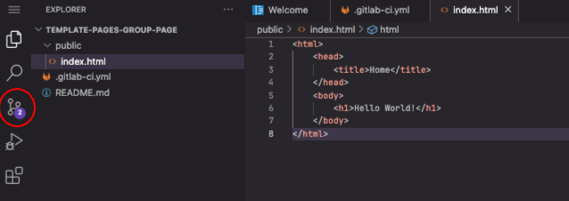
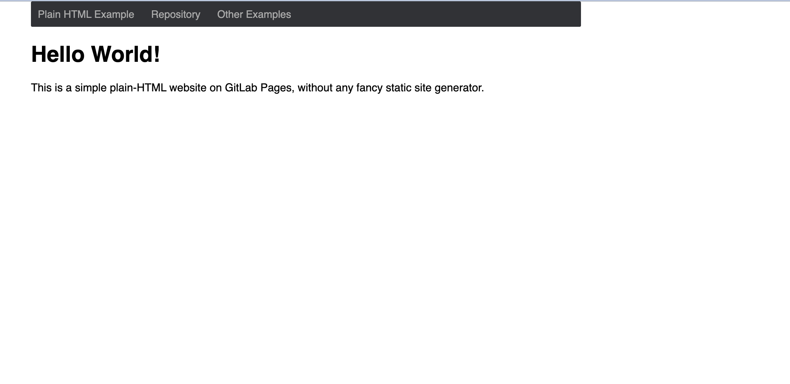

# GitLab-Seiten

> ## Nur statische Webseiten
> 
> Wie in den vorangegangenen Kapiteln bereits angedeutet, können Sie zur
> Veröffentlichung einer Website mit GitLab Pages verschiedene Technologien wie Jekyll,
> Gatsby, Hugo, Middleman, Harp, Hexo und Brunch verwenden, um nur einige zu nennen. Sie
> können auch jede _statische_ Website veröffentlichen, die direkt in einfachem HTML,
> CSS und JavaScript geschrieben ist. Pages unterstützt keine _dynamische_ serverseitige
> Verarbeitung, wie sie zum Beispiel `.php` und `.asp` erfordern.
> 
{: .callout}

Der Schlüssel dazu, dass Ihre Website wie erwartet funktioniert, ist die GitLab
CI-Konfigurationsdatei namens `.gitlab-ci.yml`. Diese Datei konfiguriert, wie Ihre
Website erstellt wird. Sie ist in _YAML_ geschrieben, das eine eigene Syntax hat, die
wir hier nicht näher erläutern werden, daher empfehlen wir Ihnen, diese Kurzanleitung zu
befolgen, bevor Sie sie einrichten. Damit sie korrekt funktioniert, muss sie in Ihrem
Stammverzeichnis, d.h. auf der gleichen Ebene wie unsere README-Datei, im
Hauptprojektordner abgelegt werden.

Das Wichtigste ist, dass Sie mit GitLab CI die Kontrolle über Ihre Builds haben. Sie
befinden sich nicht in einer unsichtbaren Blackbox, von der Sie nicht wissen, was vor
sich geht! Sie können jeden laufenden Build live sehen, indem Sie zum `Pipelines` Ihres
Projekts navigieren (wir werden dies später tun). Sie können auch einen beliebigen
Befehl zu Ihrem `.gitlab-ci.yml`-Skript hinzufügen. Damit können Sie auf dem entfernten
Server so ziemlich alles tun, was Sie auf Ihrem lokalen Rechner tun. Wir werden später
in dieser Lektion einige Beispiele zeigen, wie man eigene Build-Befehle über die
`.gitlab-ci.yml.`-Datei ausführt.

> ## Lokal oder in GitLab arbeiten
> 
> Diese Lektion zielt nicht darauf ab, Git zu lehren und wie man lokal (auf dem Laptop)
> an einem Projekt arbeitet, das in Git versioniert und verwaltet wird. Wenn Sie jedoch
> ein grundlegendes Verständnis von Git haben, können Sie die nächsten Schritte lokal
> durchführen, um zu lernen, wie man eine Website richtig entwickelt: Testen Sie sie
> lokal und übertragen Sie nur wichtige Versionen davon. Im Gegenteil, die Arbeit auf
> der Online-Plattform wird uns dazu zwingen, Versionen zu übertragen, die nicht sehr
> aussagekräftig sind, nur um des Lernens willen.
> 
> Wenn Sie ein grundlegendes Verständnis von Git haben, konfigurieren Sie ein lokales
> Projekt für die Bereitstellung. _Klonen_ Sie Ihr lokales Repository (lesen Sie die
> Lektion [git novice](https://swcarpentry.github.io/git-novice/), wenn Sie nachlesen
> wollen, was der Befehl `git clone` bewirkt und wie Sie `git push` Änderungen von
> lokalen zu entfernten Projekten übertragen). Kurz gesagt, Sie sollten nun von einem
> Terminal aus folgendes ausführen:
> ~~~
> git clone https://git.embl.de/<your username>/group-website.git
> cd group-website
> ~~~
> {: .language-bash }
> 
> und arbeiten in Ihrem geklonten Verzeichnis weiter. Sie können Ihre Dateien mit `vim`
> oder einem beliebigen Editor hinzufügen und bearbeiten - er muss nicht vom Terminal
> aus gestartet werden, aber denken Sie daran, das Terminal offen zu halten, wenn Sie
> die Änderungen wieder an die Gegenstelle übertragen müssen.
> 
{: .callout }

Wir beginnen mit dem einfachsten Beispiel, einer einfachen HTML-Seite mit GitLab-Seiten.

Lassen Sie uns die Datei `.gitlab-ci.yml` direkt in unserem GitLab-Projekt online
erstellen. Wir werden mit mehreren Dateien arbeiten müssen. Dazu öffnen wir die Web IDE,
indem wir auf die Schaltfläche oben rechts in unserem Projekt klicken: `Edit > Web IDE`.

{: .image-with-shadow width="600px" }

Wenn Sie es zum ersten Mal öffnen, erscheint ein Anpassungsfenster. Ignorieren Sie es
vorerst, aber beachten Sie, dass das Aussehen der nächsten Screenshots von dem abweichen
kann, was Sie auf der Standardvorlage sehen. Sie sollten jedoch die gleichen Menüs und
Dateien zur Verfügung haben. Insbesondere der `EXPLORER` (ein Datei-Explorer) auf der
rechten Seite listet Dateien und Ordner in Ihrem Repository auf (im Moment sollte es nur
die Datei `README` geben), und das Panel auf der rechten Seite zeigt den Inhalt solcher
Dateien, wenn Sie sie öffnen.

Fahre mit der Maus über den Namen deines Projekts im `EXPLORER`, um ein kleines Menü mit
einem Symbol zum Hinzufügen von Dateien zum Ordner zu sehen. Klicken Sie darauf und
erstellen Sie eine `.gitlab-ci.yml`-Datei. Füllen Sie diese dann mit dem folgenden
Inhalt:

Erstellen Sie Ihre `.gitlab-ci.yml` Datei und schreiben Sie hinein:

~~~
pages:
  stage: deploy
  script:
    - echo 'Nothing to do...'
  artifacts:
    paths:
      - public
  only:
    - main
~~~
> 
{: .language-yaml }

Dieser Code erstellt einen Job namens "pages", der GitLab anweist, __den Inhalt der
Website__ in `public` bereitzustellen, __immer wenn ein Commit gepusht wird__ und __nur
in den Hauptzweig__. Es hat nicht viel zu tun, außer sich den Inhalt in der
Öffentlichkeit anzuschauen, daher ist die "Skript"-Konfiguration im Grunde keine (es
gibt nur ein Echo "Nichts zu tun" ins Terminal).

> ## Validierung der Datei gitlab-ci.yml
> 
> Bevor Sie ein `.gitlab-ci.yml` in Ihr Projekt einfügen, können Sie dessen Syntax mit
> dem Tool [CI Lint] (https://docs.gitlab.com/ee/ci/lint.html) überprüfen. Sie müssen in
> Ihrem Konto angemeldet sein, um Zugang zu diesem Tool zu haben. Sie finden es, indem
> Sie zu den Pipelines Ihres Projekts navigieren: Es gibt eine Schaltfläche oben rechts
> auf Ihrem Bildschirm. Weitere Informationen finden Sie in der [vollständigen
> Dokumentation](http://doc.gitlab.com/ee/ci/yaml/README.html) für .gitlab-ci.yml.
> 
{: .callout}

> ## Git-Zweige und GitLab CI-Dateien
> 
> Sie können für jedes Projekt ein eigenes `.gitlab-ci.yml` haben - aber Sie könnten
> sogar für jeden Zweig eine eigene GitLab CI-Konfiguration haben. Das bedeutet, dass
> Sie Ihr Skript in parallelen Zweigen testen können, bevor Sie es in Ihren Hauptzweig
> übertragen. Wenn der Build erfolgreich ist, wird er zusammengeführt. Wenn nicht,
> können Sie Anpassungen vornehmen und die Erstellung erneut versuchen, ohne Ihren
> Hauptzweig zu beschädigen.
> 
{: .callout}

Als nächstes erstellen wir den Ordner `public` (verwenden Sie das Symbol für einen neuen
Ordner im Menü `EXPLORER`), der eine Datei `index.html` enthält.

> ## Lokal oder in GitLab arbeiten
> Wenn Sie lokal arbeiten, können Sie dies vom Terminal aus durch tun:
> 
> ~~~
> mkdir public
> cat > public/index.html
> ~~~
> {: .language-bash }
> 
{: .callout }

Füllen Sie die neue Datei `index.html` mit diesem Inhalt:

~~~
<html>
    <head>
        <title>Home</title>
    </head>
    <body>
        <h1>Hello World!</h1>
    </body>
</html>
~~~
> 
{: .language-html }

Bevor wir mit dem Kapitel fortfahren, versuchen Sie sich vorzustellen, wie die
endgültige Anzeige auf der resultierenden Webseite aussehen wird. Sie können es auf ein
Blatt Papier zeichnen.

> ## Lokal oder in GitLab arbeiten
> Wenn Sie lokal arbeiten, übertragen Sie jetzt Ihre Änderungen und geben Sie sie
> weiter. Sie können dies vom Hauptprojektordner aus tun:
> ~~~
> git add .
> git commit -m "simple html in public"
> git push -u origin main
> ~~~
> {: .language-bash }
> 
{: .callout }

Wenn Sie die Datei `.gitlab-ci.yml` und den Ordner `public`, der die Datei `index.html`
enthält, erstellt haben, sollten Sie alle Dateien im Ordner `EXPLORER` sehen. Speichern
wir nun die erste Version unseres Projekts (commit), indem wir das Menü `Source control`
auf der linken Seite auswählen.

{: .image-with-shadow
width="600px" }

Dies ändert das Panel auf der linken Seite, das die Dateien auflistet, die wir geändert
haben (zwei Dateien wurden hinzugefügt) und erwartet, dass Sie eine Commit-Nachricht
(eine kurze Beschreibung der Projektversion, die Sie committen) in das Textfeld oben
eingeben. Unsere Commit-Nachricht könnte in diesem Fall lauten: "Einfaches HTML über die
GitLab-Pipeline bereitstellen". Geben Sie diese oder eine andere Nachricht ein, und dann
`Commit to 'main'`.

{: .image-with-shadow width="600px"
}

Gehen Sie zurück zu Ihrem entfernten Projekt in GitLab. Der Screenshot unten zeigt, wie
es aussehen sollte:

{: .image-with-shadow
width="600px" }

Der Ordner `public` enthält die Datei `index.html`. Der Push-Befehl, den Sie gerade
gestartet haben, sollte Ihre erste Pipeline ausgelöst haben. Wählen Sie im Menü auf der
linken Seite `Build > Pipelines`, um sie zu visualisieren.

{: .image-with-shadow
width="600px" }

Da wir angehalten und überprüft haben, wie unser Remote-Ordner aussieht, ist Ihre
Pipeline vielleicht schon {: .image-with-shadow
width="100px" }. Wenn nicht, warten Sie einfach, bis es so weit ist.

Ihre erste Website wurde erfolgreich bereitgestellt! Sie fragen sich, wo Sie sie sehen
können? Gehen Sie zu `Deploy > Pages`. Die URL Ihrer Website wird dort angezeigt. Sie
sollte lauten: `https://<your user name>.embl-community.io/group-website`.

{:
.image-with-shadow width="600px" }

Der Screenshot unten enthält auch eine interessante Warnmeldung. Lesen Sie immer diese
Art von Meldungen, die von der GitLab-Benutzeroberfläche angezeigt werden, da sie in der
Regel für Sie relevant sind. Sie lautet: "Die Zugriffskontrolle ist für diese
Pages-Website aktiviert; nur autorisierte Benutzer können darauf zugreifen. Um Ihre
Website öffentlich zugänglich zu machen, navigieren Sie zu den Einstellungen Ihres
Projekts > Allgemein > Sichtbarkeit und wählen Sie im Abschnitt Seiten die Option Jeder
aus Hier finden Sie auch Links zu weiterer Dokumentation, wenn Sie mehr wissen möchten.
Folgen Sie den Anweisungen, wenn Sie Ihre Website öffentlich zugänglich machen möchten.

Unabhängig davon, ob sie öffentlich ist oder nicht, sollten wir in der Lage sein, unsere
eigene Website zu visualisieren. Klicken Sie auf den Link, und hier ist sie:

{: .image-with-shadow
width="600px" }

> ## Übung: Vergleichen Sie mit Ihrer Skizze
> Sieht die soeben eingerichtete Website so aus, wie Sie es sich anhand des HTML-Codes
> in der Indexdatei vorgestellt haben? Hätten Sie gedacht, dass etwas anderes angezeigt
> werden würde? Diskutieren Sie mit Ihrem Kollegen neben Ihnen.
> 
{: .challenge }

> ## Übung: Die plain-html Vorlage
> GitLab bietet eine Reihe von Vorlagen für Webseiten, die über Pages bereitgestellt
> werden. Eine davon heißt "plain-html", die Sie unter [diesem
> Link](https://gitlab.com/pages/plain-html) aufrufen können. Die allgemeine Struktur
> ist derjenigen, die wir gerade verwendet haben, sehr ähnlich. Gehen Sie in den Ordner
> `public`. Hier gibt es zwei Dateien, eine `style.css`-Datei und eine
> `index.html`-Datei.
> 
> Wir werden in dieser Lektion auf die Funktionsweise der Datei `.css` eingehen, aber es
> könnte jetzt interessant sein, einen Blick auf ihre Syntax und ihren Inhalt zu werfen.
> Dieser Dateityp wird für die Gestaltung von HTML-Inhalten verwendet. Diese spezielle
> Datei enthält Stilanweisungen für drei Elemente: das `body`, das `navbar` und den
> Linktext (`a`) innerhalb der Navigationsleiste, der seine Farbe ändert, wenn man mit
> der Maus darüber fährt (`a:hover`). Machen Sie sich jetzt keine Gedanken darüber, wie
> das genau funktioniert, aber wenn Sie sich diese Seite ansehen, denken Sie daran, mit
> der Maus über die Links in der Navigationsleiste zu fahren, um dies in Aktion zu
> sehen.
> 
> Öffnen Sie nun die Datei `index.html`. Ihr Inhalt wird im Folgenden wiedergegeben.
> 
> ~~~
> <!DOCTYPE html>
> <html>
>  <head>
>    <meta charset="utf-8">
>    <meta name="generator" content="GitLab Pages">
>    <title>Plain HTML site using GitLab Pages</title>
>    <link rel="stylesheet" href="style.css">
>  </head>
>  <body>
>    

>      <a href="https://pages.gitlab.io/plain-html/">Plain HTML Example</a>
>      <a href="https://gitlab.com/pages/plain-html/">Repository</a>
>      <a href="https://gitlab.com/pages/">Other Examples</a>
>    

> 
>    <h1>Hello World!</h1>
> 
>    

>      This is a simple plain-HTML website on GitLab Pages, without any fancy static site generator.
>    

>  </body>
> </html>
> ~~~
> {: .language-html }
> 
> Es ist wieder Zeit zum Skizzieren! Zeichnen Sie die resultierende Webseite mit dem
> Inhalt dieser HTML-Datei. Hinweis: Die Navigationsleiste ist eine Leiste am oberen
> Rand der Seite, die es uns ermöglicht, im Inhalt der Website zu navigieren.
> 
> Optionale Frage: Wie wird die Datei `.css` verwendet? Woher weiß die Website, welches
> die richtige Datei zum Lesen ist?
> 
> > ## Lösung
> > 
> > Sie können auf die [deployed website](https://pages.gitlab.io/plain-html/) gehen, um
> > zu sehen, wie es aussieht. Hier unten ein Screenshot des Ergebnisses:
> > 
> > {: .image-with-shadow
> > width="600px" }
> > 
> > Gibt es einen Unterschied zu Ihrer Skizze?
> > 
> > Optionale Frage: Der Speicherort der `.css` Datei ist in der `.html` Datei
> > angegeben, durch: `<link rel="stylesheet" href="style.css">`.
> > 
> > 
> {: .solution }
> 
{: .challenge }

## Nützliche Links

Sie haben jetzt die minimalen Werkzeuge, um mit HTML und CSS herumzuspielen. Sie können
die beiden Dateien aus der letzten Übung [template](https://gitlab.com/pages/plain-html)
in Ihr Repository kopieren und versuchen, die Textgröße, die Farbe der
Navigationsleiste, Links oder die Textformatierung zu bearbeiten. Wenn Sie sich
entschließen, dieses Repository zu faken, um zu experimentieren, tun Sie bitte, was die
Autoren in ihrer README-Datei verlangen (ein Grund mehr, die README-Dateien in jedem
anderen Projekt zu konsultieren und sie sorgfältig zu kompilieren): "Wenn Sie dieses
Projekt für Ihren eigenen Gebrauch geforkt haben, gehen Sie bitte zu den __Settings__
Ihres Projekts und entfernen Sie die Forking-Beziehung, was nicht notwendig ist, es sei
denn, Sie wollen wieder zum Upstream-Projekt beitragen."

Ein umfangreiches Tutorial über HTML-Elemente, einschließlich Beispielen für die
Einbettung von Formularen, Medien und Links, finden Sie unter
[w3schools](https://www.w3schools.com/html/default.asp). Zusätzlich zu diesem Tutorial
gibt es viele andere Quellen, die HTML-Tutorials anbieten. Sie können auf jeden Fall
eine auswählen, die Ihrem Geschmack entspricht, um mehr zu lernen.



