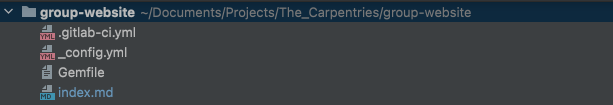

[Jekyll](https://jekyllrb.com/) ist ein leistungsstarker Generator für statische
Websites, der hinter GitLab Pages stehen kann. Er erstellt statische
HTML-Website-Inhalte aus verschiedenen Dateien in Ihrem Repository (Markdown-Dateien,
CSS-Stylesheets, Seitenvorlagen/Layouts usw.). Dieser "kompilierte" Inhalt wird dann als
Ihre Website bereitgestellt.

Jekyll macht die Verwaltung Ihrer Website einfacher, weil es auf Vorlagen basiert.
Vorlagen (oder Layouts in der Jekyll-Schreibweise) sind Entwürfe, die von mehreren
Seiten wiederverwendet werden können. Zum Beispiel haben wir (Ihre Ausbilder) nicht jede
einzelne Übung in dieser Lektion separat gestaltet: Wir haben eine Vorlage erstellt, die
angibt, wie die Übungen angezeigt werden sollen (die orangefarbene Box, die
Dropdown-Lösungsbox usw.) und jedes Mal, wenn wir einen Textblock als "Übung" markieren,
wird er auf diese Weise angezeigt.

Wir werden Jekyll-Layouts in Kürze behandeln; für den Moment wollen wir Jekyll und seine
Skriptsprache namens [Liquid](https://shopify.github.io/liquid/basics/introduction/)
lernen.

## Globale Parameter

Auch in diesem Fall werden wir unser Deployment aus der Datei `.gitlab-ci.yml` auslösen
und anpassen. Sie können Ihre vorherige Version des `group-website`-Repositorys
bearbeiten, wir empfehlen jedoch, eine neue Version zu erstellen. Folgen Sie den
Schritten in "Einrichten eines Projekts" in der [Einführung]
(https://grp-bio-it-workshops.embl-community.io/building-websites-with-gitlab/01-introduction/index.html),
wenn Sie dies tun möchten. Erstellen/ändern Sie den Inhalt der `.gitlab-ci.yml` Datei
mit:

~~~
image: ruby:latest

pages:
  script:
    - gem install bundler
    - bundle install
    - bundle exec jekyll build -d public
  artifacts:
    paths:
      - public
  only:
    - main
~~~
> 
{: .language-yaml }

Dieser Code setzt voraus, dass das Skript in der Umgebung der neuesten Ruby-Version
läuft, installiert das Jekyll-Gem und baut die Site im öffentlichen Pfad auf (der Ordner
wird aus der Ferne erstellt, Sie sollten sich zu diesem Zeitpunkt keine Sorgen machen).
Das Ergebnis betrifft nur den Hauptzweig.

Die Ausführung dieser Pipeline erfordert auch eine `Gemfile`. Erstellen Sie diese im
Stammordner mit dem folgenden Inhalt:
~~~
source "https://rubygems.org"

gem "jekyll"
~~~
> 
{: .language-shell }

Kurz gesagt, aber wir werden uns das noch genauer ansehen, sucht Jekyll nach
Textdateien, die mit einem Header beginnen, der wie folgt formatiert ist:

~~~
---
variable: value
other_variable: other_value
---

...stuff in the page...
~~~
> 
{: .source}

und fügt die Werte dieser Variablen in die Seite ein, wenn sie formatiert wird. Die drei
Bindestriche, mit denen die Kopfzeile beginnt, *müssen* die ersten drei Zeichen in der
Datei sein: Schon ein einzelnes Leerzeichen davor führt dazu, dass Jekyll die Datei
ignoriert.

Der Inhalt des Headers muss als YAML formatiert sein und kann Booleans, Zahlen,
Zeichenketten, Listen und Wörterbücher mit Name/Wert-Paaren enthalten. Die Werte der
Kopfzeile werden in der Seite als `page.variable` bezeichnet. Zum Beispiel, diese Seite:

~~~
---
name: Science
---
Today we are going to study {{page.name}}.
~~~
> 
{: .source}

wird übersetzt in:

~~~
<html>
  <body>
    
Today we are going to study Science.

  </body>
</html>
~~~
> 
{: .html}

> ## Übung: Die Syntax von Jekyll
> Testen Sie Ihr Verständnis von Jekylls Syntax. In was würde diese Vorlage übersetzt
> werden?
> ~~~
> ---
> name: Tom
> location: Heidelberg
> ---
> {{page.name}} is in {{page.location}}. I believe {{page.location}} is a very nice city.
> ~~~
> {: .source}
> 
> > ## Lösung
> > ~~~
> > <html>
> >   <body>
> >     
Tom is in Heidelberg. I believe Heidelberg us a very nice city.

> >   </body>
> > </html>
> > ~~~
> > {: .html}
> > 
> > 
> > 
> {: .solution }
> 
{: .challenge }

Die Hauptkonfigurationsoptionen von Jekyll werden jedoch in einer anderen Datei namens
`_config.yml` angegeben. Lassen Sie uns einige Konfigurationsparameter für unsere
Website erstellen.

1. Erstellen Sie eine `_config.yml`-Datei im Stammverzeichnis Ihrer Website.
2. Fügen Sie die Parameter `description` und `email` hinzu als:

~~~
description: This project develops training materials for reseachers wanting to learn to build project
websites in GitLab Pages.
email: team@carpentries.org
~~~
> 
{: .language-yaml}

Globale Konfigurationseinstellungen von `_config.yml` werden als
`site.PARAMETER_NAME`-Variable in jeder Seite innerhalb der Website verfügbar gemacht.
Auf den globalen Parameter `email`, den wir oben definiert haben, würde also als
`site.email` zugegriffen werden. Bitte beachten Sie: Es handelt sich um globale
Parameter, die sich von den lokalen seitenbezogenen Parametern in den obigen Beispielen
unterscheiden.

Um auf den Wert des Parameters innerhalb einer Seite zuzugreifen, verwenden Sie die
Liquid-Notation, um den Inhalt auszugeben, indem Sie eine Variable in geschweifte
Klammern wie `{{ variable }}` einschließen.

> ## Vordefinierte globale Parameter
> Zusätzlich zu den globalen Parametern, die Sie definieren, stellt Ihnen Jekyll auch
> eine Reihe von [nützlichen vordefinierten seitenweiten
> Variablen](https://jekyllrb.com/docs/variables#site-variables) innerhalb Ihrer Website
> zur Verfügung: z.B. `{{ site.time }}` (die aktuelle Zeit) oder
> `{{ site.pages }}` (eine Liste aller Seiten).
> 
{: .callout}

Erstellen Sie eine `index.md` Datei im Stammverzeichnis, mit dem folgenden Inhalt:

~~~
---
title: My first Jekyll page
---

# Building Websites with Jekyll and GitLab

## Description
{{ site.description }}
Welcome to {{ page.title }}

Have any questions about what we do? [We'd love to hear from you!](mailto:{{ site.email }})
~~~
> 
{: .language-markdown }

Ihr Projekt sollte die folgenden Dateien enthalten:

{: .image-with-shadow width="600px" }

Commit und push Ihre Änderungen, dann überwachen Sie die Ausführung der Pipeline und
überprüfen Sie das Endergebnis unter Ihrer `https://<your user
name>.embl-community.io/group-website` URL.

> ## Übung: Einen globalen Twitter-Parameter erstellen
> In `about.md` haben wir eine Twitter URL unter dem Abschnitt 'Contact us'. Das ist
> eine Information, die in die globalen Parameter in `_config.yml` aufgenommen werden
> könnte, da Sie sie vielleicht in der Fußzeile jeder Seite wiederholen möchten. Nehmen
> Sie Änderungen an Ihrer Website vor, um die Twitter-URL als globalen Parameter zu
> extrahieren.
> > ## Lösung
> > 1. Füge den Parameter twitter zu `_config.yml` hinzu:
> >    ~~~
> >    description: "This research project develops training materials for reseachers wanting to learn to build project
> >    websites in GitHub with GitHub Pages."
> >    email: "team@carpentries.org"
> >    twitter: "https://twitter.com/thecarpentries"
> >    ~~~
> >    {: .language-yaml}
> > 
> > 
> > 2. Benutzen Sie den Twitter-Parameter in `about.md`:
> > 
> >    ~~~
> >    # About
> > 
> >    ## Project
> > 
> >    {{ site.description }}
> > 
> >    ## Funders
> > 
> >    We gratefully acknowledge funding from the XYZ Founding Council, under grant number 'abc'.
> > 
> >    ## Cite us
> > 
> >    You can cite the project as:
> > 
> >    > *The Carpentries 2019 Annual Report. Zenodo. https://doi.org/10.5281/zenodo.3840372*
> > 
> >    ## Contact us
> > 
> >    - Email: [{{ site.email }}](mailto:{{ site.email }})
> >    - Twitter: [{{ site.twitter }}]({{ site.twitter }})
> >    ~~~
> >    {: .language-markdown }
> > 
> > 
> > 3. Beachten Sie, dass Sie eigentlich keine Änderungen an Ihrer Website sehen
> >    sollten. Allerdings können Sie jetzt von jeder Seite Ihrer Website aus auf Ihre
> >    Twitter-URL zugreifen, falls Sie dies wünschen.
> > 
> {: .solution}
> 
{: .challenge}

## Lokale Parameter

Zusätzlich zu den globalen (site-weiten) Parametern, die über die globale Variable
`site` verfügbar sind, stellt Jekyll _lokale_ (seiten-spezifische) Informationen über
die Variable `page` zur Verfügung. Einige davon sind vordefiniert - wie `page.title`,
die Ihnen den Titel der Seite gibt, die gerade aktiv ist/besucht wird. Andere können Sie
selbst definieren. Sehen Sie sich diese [Liste der vordefinierten
Seitenparameter](https://jekyllrb.com/docs/variables#page-variables) an.

Sie können innerhalb einer Markdown-Seite lokale Parameter in YAML-Notation definieren,
indem Sie diese in einen Seitenkopf einfügen und den Kopf mit dreifach gestrichelten
Linien `---` abgrenzen. Diese Header werden *front matter* genannt und dienen dazu,
Variablen und Metadaten auf einzelnen Seiten Ihrer Jekyll-Site zu setzen.

> ## Titelbild
> Von [Jekylls Website](https://jekyllrb.com/docs/front-matter/):
> 
> > Jede Datei, die einen YAML-Frontmaterie-Block enthält, wird von Jekyll als eine
> > spezielle Datei verarbeitet. Der Frontmatter muss das erste Element der Datei sein
> > und muss die Form von gültigem YAML haben, das zwischen dreifach gestrichelten
> > Linien steht.
> 
{: .callout}

> ## Globale und lokale Parameter sind Case Sensitive
> Es ist wichtig zu beachten, dass die in den Seiten verwendeten Parameter zwischen
> Groß- und Kleinschreibung unterscheiden. Normalerweise werden sie alle in
> Kleinbuchstaben geschrieben.
> 
{: .callout}

Hier ist ein Beispiel:

~~~
---
layout: post
title: "My first blog post"
author: "Danger Mouse"
---
~~~
> 
{: .language-yaml }

Zwischen diesen dreifach gestrichelten Linien können Sie vordefinierte Variablen (wie
`page.layout` oder `page.title`) überschreiben oder benutzerdefinierte Variablen
erstellen, die Sie lokal auf der Seite benötigen (wie `page.author`). Auf diese
Variablen können Sie dann über die Tags von Liquid (z. B. `{{
page.title }}` ) weiter unten in der Datei und in allen Dateien,
die diese enthalten, zugreifen. Beachten Sie, dass diese Variablen nur auf dieser Seite
zugänglich sind. Sie erhalten eine Fehlermeldung, wenn Sie versuchen, auf eine
`page.variable` zu verweisen, die auf einer anderen Seite definiert wurde.

> ## Übung: Übung mit lokalen Variablen
> 
> Lassen Sie uns die Erstellung und Verwendung lokaler Variablen üben. Denken Sie an
> eine lokale Variable, die Sie nur auf Ihrer Seite `about.md` oder `index.md` verwenden
> wollen. Wenn Ihnen keine einfällt, erstellen Sie eine lokale Variable mit dem Namen
> 'lesson-example' mit dem Wert 'https://carpentries.github.io/lesson-example/' und
> verweisen Sie auf sie in Ihrer `index.md`.
> 
> Was haben Sie zu Ihrem `index.md` hinzugefügt, um diese Variable zu erstellen? Wo
> haben Sie das Frontmate in Ihrer `index.md` eingefügt? Wie haben Sie diese Variable
> referenziert?
> 
> > ## Lösung
> > 
> > Erstellen Sie einen YAML-Header ganz oben in `index.md` und fügen Sie die Variable
> > `lesson-example` zwischen den dreifachen Trennstrichen ein. Sie können dann auf den
> > Wert innerhalb Ihrer `index.md` Seite als `{{
> > page.lesson-example }}` verweisen. Ihre Datei sollte nun wie
> > folgt aussehen:
> > 
> > ~~~
> > ---
> > lesson-example: "https://carpentries.github.io/lesson-example/"
> > ---
> > 
> > # Building Websites in GitHub
> > 
> > ## Description
> > {{ site.description }}
> > 
> > More details about the project are available from the [About page](about).
> > 
> > See some [examples of our work]({{ page.lesson-example }}).
> > 
> > Have any questions about what we do? [We'd love to hear from you!](mailto:{{ site.email }})
> > ~~~
> > {: .language-markdown }
> > 
> > 
> > Beachten Sie, dass diese Variable nicht von der Seite `about.md` aus zugänglich ist
> > und lokal auf `index.md` liegt.
> > 
> {: .solution}
> 
{: .challenge}

## Hinzufügen neuer Seiten

Der nächste Schritt wird sein, eine weitere Seite dieser Website zu erstellen.
Idealerweise wird unsere Website mehrere Seiten haben, und um Ordnung zu halten, werden
wir den Ordner `pages` erstellen, um sie zu speichern. Erstellen Sie in diesem Ordner
eine `about.md`-Datei mit folgendem Inhalt:

~~~
---
title: About
permalink: /about/
---

# About

## Project

{{ site.description }}

## Funders

We gratefully acknowledge funding from the XYZ Founding Council, under grant number 'abc'.

## Cite us

You can cite the project as:

>    *The Carpentries 2019 Annual Report. Zenodo. https://doi.org/10.5281/zenodo.3840372*

## Contact us

- Email: [{{ site.email }}](mailto:{{ site.email }})
- Twitter: [@thecarpentries](https://twitter.com/thecarpentries)
~~~
> 
{: .language-markdown }

Beachten Sie, dass die URL dieser Seite in der Kopfzeile durch das Attribut `permalink`
angegeben ist.

Dies ist der aktuelle Aspekt Ihres Ordners:

{: .image-with-shadow width="600px" }

Nun sollten wir die Datei `index.md` editieren, um einen Link zu dieser neuen
About-Seite einzufügen, damit sie von der Hauptseite aus erreicht werden kann. Fügen Sie
eine Zeile in `index.md` ein:

~~~
More details about the project are available from the [About page](about).
~~~
> 
{: .language-markdown }

Der Link in dieser Zeile wird auf `https://<your user
name>.embl-community.io/group-website/about` umleiten, das ist die URL unserer neuen
About-Seite.

Commit, push und gehen Sie auf Ihre Website, um die Änderungen zu sehen. Beachten Sie,
dass Site-Parameter bei der Anzeige von Dateien in GitHub nicht korrekt dargestellt
werden (sie werden als Text `{{ site.PARAMETER_NAME }}` und nicht
als gerenderter Wert des Parameters angezeigt), aber auf der Website schon.

> ## Wiederverwenden und Reduzieren
> Jekylls globale Parameter sind ein nützlicher Weg, um all Ihre site-weiten
> Konfigurationen an einem einzigen Ort zu halten (selbst wenn Sie sie nur einmal
> benutzen). In Kombination mit Jekyll-Layouts/Vorlagen (die in der nächsten Folge
> behandelt werden) sind sie eine großartige Möglichkeit, wiederverwendbare
> Markup-Snippets zu erstellen, die auf mehreren oder sogar auf jeder Seite Ihrer
> Website wiederholt werden können. Wiederverwendung hilft Ihnen, die Menge an Code zu
> reduzieren, die Sie schreiben müssen.
> 
{: .callout}

## Nützliche Links

Dies sollte nur ein sehr grundlegendes Tutorial sein. Die Möglichkeiten der
Seitenanpassung mit Jekyll gehen weit über das hinaus, was hier gezeigt wurde, man
könnte zum Beispiel:

- Entwurf von Seitenlayouts (wie die Übungen/Lösungen in dieser Lektion),
- mit Schleifen arbeiten, um Variablen mit mehreren Werten iterativ zu verarbeiten,
- Verwenden Sie Filter, um das Format der Variablen zu kontrollieren, wenn sie in eine
  Seite eingefügt werden,

und mehr. [Diese Lektion](https://carpentries-incubator.github.io/jekyll-pages-novice/)
von The Carpentries ist, auch wenn sie für GitHub konzipiert ist, eine wertvolle
Ressource, um mehr darüber zu erfahren, wie man das macht.

Wenn Sie nach der offiziellen GitLab-Dokumentation über GitLab Pages mit Jekyll suchen,
folgen Sie [diesem
Link](https://docs.gitlab.com/ee/user/project/pages/getting_started/pages_from_scratch.html).

Schließlich enthält [dieses Projekt](https://gitlab.com/pages/jekyll) eine ausgefeiltere
Vorlage für eine auf GitLab und Jekyll basierende Website.



