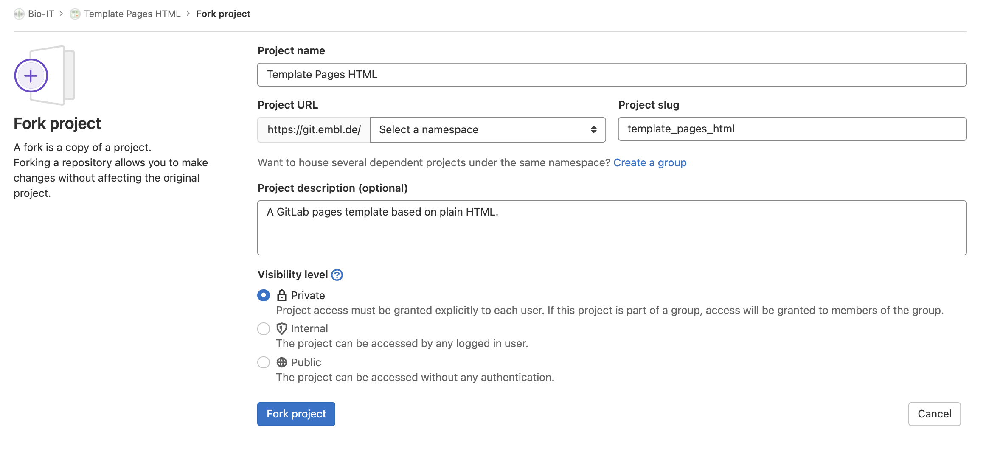

## Bio-IT-Vorlagen

Die Vorlagen, die wir gemeinsam entwickelt haben, sind in unserer GitLab-Plattform
verfügbar:
- [Plain HTML template](https://git.embl.de/grp-bio-it/template_pages_html)
- [Jekyll-Vorlage](https://git.embl.de/grp-bio-it/template-pages-jekyll)
- [Sphinx-Vorlage](https://git.embl.de/grp-bio-it/template-pages-sphinx)
- [Jupyter-Buch](https://git.embl.de/grp-bio-it/template-jupyter-book)

Sie könnten im Vergleich zu dem, was wir in dieser Lektion durchgenommen haben, leicht
angereichert sein, zum Beispiel enthält die einfache HTML-Vorlage auch eine
`.css`-Datei, aber sie sind absichtlich minimal gehalten. Wenn Sie sie als Basis für Ihr
eigenes Projekt verwenden wollen, sollten Sie sie **aufspalten**. Wenn Sie dies tun, um
Ihr eigenes Projekt zu entwickeln und nicht, um zur Vorlage selbst beizutragen, sollten
Sie als nächstes **die Fork-Beziehung** aufheben. Lassen Sie uns den Prozess gemeinsam
durchgehen.

Forken Sie ein Projekt, indem Sie auf die Schaltfläche "Fork" auf der rechten Seite des
Projekttitels klicken. Daraufhin öffnet sich ein Menü (siehe unten), das dem Menü, das
beim Öffnen eines neuen Projekts angezeigt wird, sehr ähnlich ist. Sie können
entscheiden, ob Ihr Projekt privat bleiben soll, und den Titel und die Beschreibung
bearbeiten. Sie können es auch in die entsprechende Gruppe/den entsprechenden Namensraum
einordnen.

Sobald Sie fertig sind, entfernen Sie bitte die Fork-Beziehung. Sie können die
Projekteinstellungen im linken Menü auf der Projektseite bearbeiten, folgen Sie
`Settings > General > Advanced` und scrollen Sie dann nach unten zur Karte "Remove fork
relationship".

Sobald dies erledigt ist, können Sie Ihr Repository lokal klonen und mit der Bearbeitung
der Vorlage beginnen. Wenn Sie eine Zusammenfassung über Klonen, Forking, Pushing und
Pulling in Git benötigen, lesen Sie bitte [diese Lektion]
(https://swcarpentry.github.io/git-novice/) von The Carpentries.

## Weitere Vorlagen

Sie fragen sich, wo Sie weitere Beispiele für GitLab-Seitenprojekte finden können? Sehen
Sie sich [diesen Link](https://gitlab.com/pages) an. Er enthält mehr als 40 Beispiele,
die auf verschiedenen Technologien basieren. Auch in diesen Fällen ist es eine gute
Praxis, die Fork-Beziehung zu entfernen, wenn Ihr Ziel darin besteht, die Vorlage für
die Entwicklung Ihrer eigenen Website zu verwenden und nicht, zur Vorlage selbst
beizutragen. Einige Beispiele für Vorlagen, die Sie in diesem Repository finden, sind:
- [**courseware-template**](https://gitlab.com/pages/courseware-template), eine
  Jekyll-basierte Vorlage für eine Kurs-Website. Sie können es
  [hier](https://courseware-as-code.gitlab.io/courseware-tutorial/) in Aktion sehen. Es
  enthält Stile zur Formatierung von Vorlesungsinhalten, Quizfragen und Folien.
- [**hugo blog template**](https://gitlab.com/pages/hugo), die Vorlage für [build
  blogs](https://pages.gitlab.io/hugo/) basierend auf [Hugo](https://gohugo.io/).
- [**jupyterbook**](https://gitlab.com/pages/jupyterbook), eine Vorlage zur Erstellung
  von Büchern und Dokumenten, die Python-Code integrieren. Sehen Sie es gerendert
  [hier](https://pages.gitlab.io/jupyterbook/intro.html).

Jetzt haben Sie das nötige Fachwissen, um mit GitLab-Seiten zu arbeiten. Wenn Sie Fragen
haben, wenden Sie sich bitte an [contact us](mailto:bio-it@embl.de) oder öffnen Sie ein
Issue in den Template-Projekten, um Funktionen anzufordern oder Probleme zu lösen. Sie
sind auch herzlich eingeladen, zur Entwicklung von Seitenvorlagen beizutragen, sowohl zu
den bestehenden als auch zu neuen, die für Ihre Anwendungsfälle geeignet sein könnten.
Schauen Sie sich schließlich das nächste (Bonus-)Kapitel an, um zu erfahren, wie man mit
Fehlern in der Pipeline-Ausführung umgeht, um eventuelle CI/CD-Fehler beheben zu können!



